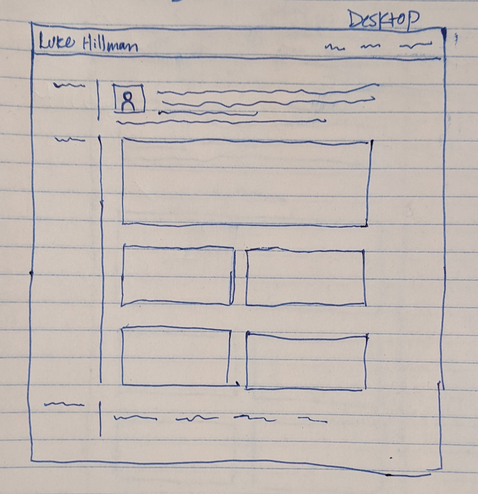
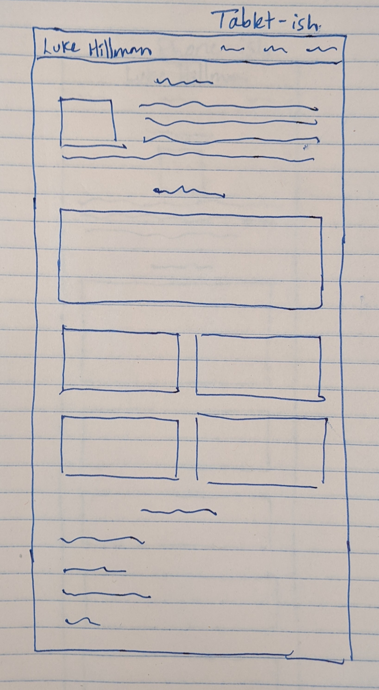
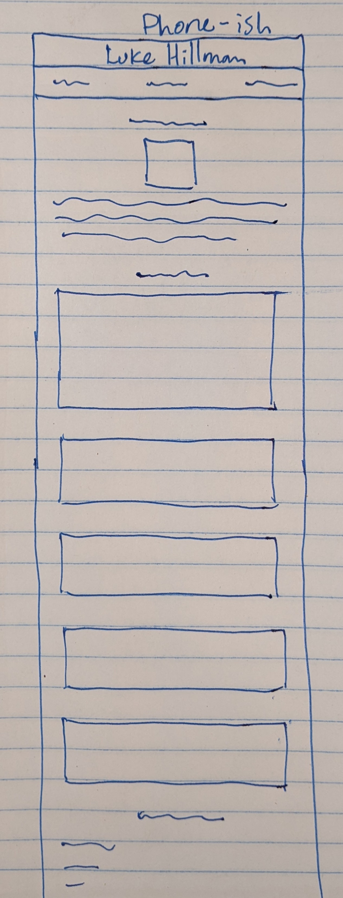

# portfolio

A small, responsive [site](https://lshillman.github.io/portfolio/) to showcase my projects. Very much a work in progress, and currently limited to projects where I'm a developer. For UX and HCI research/design projects, see [lukehillman.net](https://lukehillman.net).

I was trying to use this project to get acclimated to using flexbox. That was a success, but left very little time to spend on visual flair. I think that's okay.

## UX wireframe

I'm a fan of design-specific breakpoints (as opposed to device-specific ones), so that's what I used. The methodology is essentially "view your page in the browser. Make the window narrower or wider until your design looks like crap, and that's where a breakpoint goes." Anyway, here's the general layout I was shooting for:

## Demo

I think I was fairly successful achieving the layout, though admittedly the code is not as elegant as it could be in some places. I'll be iterating on it as I have time.

https://user-images.githubusercontent.com/5232938/174913007-732d32c3-605b-443e-8f6c-f34987da36d0.mov
